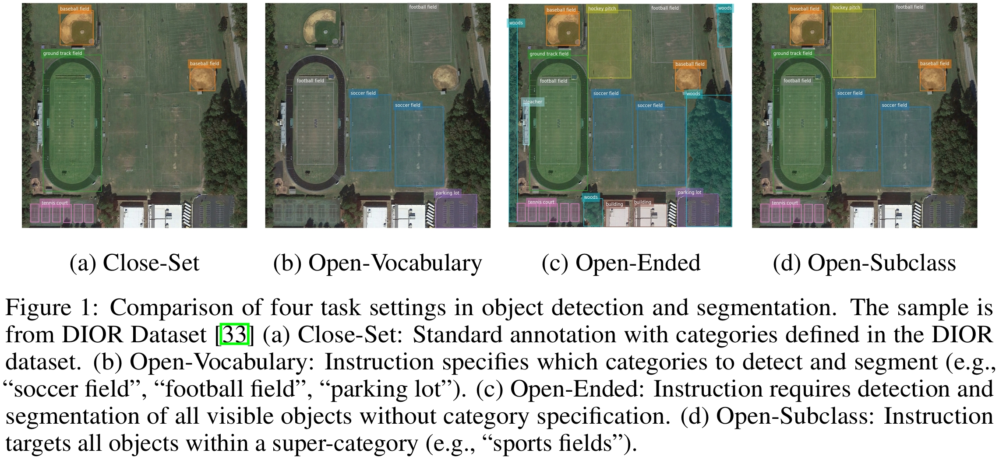
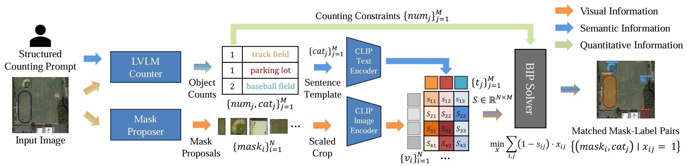
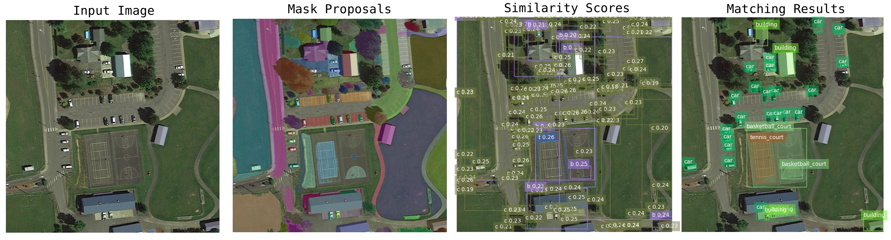

# Technical Appendices for EarthInstruct and InstructSAM

Anonymous Authors

## Note
Remove author names, API keys, and working paths when submitting anonymous code.

## Introduction
InstructSAM is a training-free framework for Instruction-Oriented Object Counting, Detection, and Segmentation (InstructCDS). We construct EarthInstruct, an InstructCDS benchmark for remote sensing. The instructions included in EarthInstruct are open-vocabulary, open-ended, and open-subclass.



InstructSAM addresses InstructCDS by decomposing them into several tractable steps.


## Prerequisites
### Installation
1. Create a new conda environment.
`python>=3.10` and `torch>=2.5.1` are recommended for compatibility with SAM2.
```bash
conda create -n insam python=3.10
conda activate insam
pip install torch==2.5.1 torchvision==0.20.1 --index-url https://download.pytorch.org/whl/cu121
```
2. Install `SAM2`.
```bash
# git clone xxxxx
cd InstructSAM/third_party/sam2
pip install -e ".[notebooks]"
```
3. Install `instruct_sam` and its dependencies.
```bash
cd ../../
pip install -e .
```

### Checkpoint Download
For double-blind review, this code only references publicly available third-party resources.

Download the pretrained models to the ./checkpoint directory or any preferred location.

**[Important]** Please store the checkpoint path of CLIP models in [CLIP checkpoints config](checkpoints/config.yaml), so that the CLIP model can be switched to different variants by modifying the model name.
- LVLM Counter

Download [Qwen2.5-VL](https://huggingface.co/Qwen/Qwen2.5-VL-7B-Instruct/tree/main) or use an API request in OpenAI format.
```bash
huggingface-cli download Qwen/Qwen2.5-VL-7B-Instruct \
                         --local-dir ./checkpoints/Qwen2.5-VL-7B-Instruct \
                         --resume-download
```

- Mask Proposer
  - [sam2_hiera_large.pt](https://dl.fbaipublicfiles.com/segment_anything_2/072824/sam2_hiera_large.pt)

- CLIP Model
  - [DFN2B-CLIP-ViT-L-14-39B](https://huggingface.co/apple/DFN2B-CLIP-ViT-L-14-39B/resolve/main/open_clip_pytorch_model.bin?download=true)
  - [GeoRSCLIP-ViT-L-14](https://huggingface.co/Zilun/GeoRSCLIP/resolve/main/ckpt/RS5M_ViT-L-14.pt?download=true)
  - [GeoRSCLIP-ViT-B-32](https://huggingface.co/Zilun/GeoRSCLIP/resolve/main/ckpt/RS5M_ViT-B-32.pt?download=true)
  - [SkyCLIP-ViT-L-14](https://opendatasharing.s3.us-west-2.amazonaws.com/SkyScript/ckpt/SkyCLIP_ViT_L14_top30pct_filtered_by_CLIP_laion_RS.zip)
  - [SkyCLIP-ViT-B-32](https://opendatasharing.s3.us-west-2.amazonaws.com/SkyScript/ckpt/SkyCLIP_ViT_B32_top50pct.zip)
  - [RemoteCLIP-ViT-L-14](https://huggingface.co/chendelong/RemoteCLIP/resolve/main/RemoteCLIP-ViT-L-14.pt?download=true)
  - [RemoteCLIP-ViT-B-32](https://huggingface.co/chendelong/RemoteCLIP/resolve/main/RemoteCLIP-ViT-B-32.pt?download=true)

### Dataset Preparation
We provide a subset of DIOR with 4 images for quickly going through the entire pipeline. The detailed benchmark category split is stored in the [dataset config](datasets/config.json).

| Dataset     | Image                                                                 | Annotation                          |
| ----------- | -------------------------------------------------------------------- | ----------------------------------- |
| DIOR-mini   | [datasets/dior/JPEGImages-trainval](datasets/dior/JPEGImages-trainval/)                          | [dior_mini_ann.json](datasets/dior/dior_mini_ann.json) |
| DIOR        | [Google Drive](https://drive.google.com/drive/folders/1UdlgHk49iu6WpcJ5467iT-UqNPpx__CC) | [dior_ins_val_ann.json](datasets/dior/dior_ins_val_ann.json) |
| NWPU-VHR-10 | [One Drive](https://1drv.ms/u/s!AmgKYzARBl5cczaUNysmiFRH4eE)         | [nwpu_ins_ann.json](datasets/nwpu/nwpu_ins_ann.json) |

## Getting Started
See the example notebooks for more details. After initializing pretrained models, inference can be executed clearly. See [inference_demo.ipynb](demo/inference_demo.ipynb) for more details.
```python
instruct_sam = InstructSAM()
instruct_sam.count_objects(prompt, gpt_model="gpt-4o-2024-11-20", json_output=True)
print(f'response: \n{instruct_sam.response}')
>>> {
>>>      "car": 23,
>>>      "building": 5,
>>>      "basketball_court": 2,
>>>      "tennis_court": 1
>>> }
```

```python
instruct_sam.segment_anything(mask_generator, max_masks=200)
instruct_sam.calculate_pred_text_features(model, tokenizer, use_vocab=False)
instruct_sam.match_boxes_and_labels(model, preprocess, show_similarities=True)
visualize_prediction(instruct_sam.img_array, instruct_sam.boxes_final,
                     instruct_sam.labels_final, instruct_sam.segmentations_final)
```


## Inference
Please prepare the metadata in COCO annotation format. For unannotated datasets, simply leave the 'annotations' field blank. Replace the configuration files for [datasets](datasets/config.json) and [CLIP checkpoints](checkpoints/config.yaml) with your local paths. These config files are used by default in the following scripts.

### Object Counting
First, prepare your prompts in the [prompts](prompts) folder.

The counting result for each image is saved in JSON format, following the structure:
```
{
    "category_name1": number1 (int),
    "category_name2": number2 (int),
}
```
- For inference using API, it is recommended to perform asynchronous requests for faster results.
```bash
python inference_tools/async_count.py --dataset_name dior_mini \
                                      --dataset_config datasets/config.json \
                                      --base_url your_base_url \
                                      --api_key your_api_key \
                                      --model gpt-4o-2024-11-20 \
                                      --prompt_path prompts/dior/open_vocabulary.txt
```
Add --skip_existing if a request occasionally fails. The script will skip images that have already been processed.

- Alternatively, use a locally deployed LVLM for inference. For example, use `Qwen2.5-VL-7B-Instruct` to count objects.
```bash
python inference_tools/qwen_count.py --dataset_name dior_mini \
                                     --pretrained_model_name_or_path ./checkpoints/Qwen2.5-VL-7B-Instruct \
                                     --prompt_path prompts/dior/open_ended.txt
```

### Generate Mask Proposals Using SAM2

The format of region (mask) proposals (e.g., [sam2_hiera_l.json](region_proposals/dior_mini/sam2_hiera_l.json)) follows a simple structure: The mask is stored in RLE format and can be decoded to a binary mask using the COCO API.
```
{
    "img_name":{
        "bboxes": [...
        ],
        "labels": [
            "region_proposals",
            ...
        ],
        "scores": [...
        ],
        "segmentations": [...
        ],
    },
    "img_name2":{...
    },
    ...
}
```

Generate mask proposals with your own checkpoint and config path (Please add '/' before the absolute cfg path):
```bash
python inference_tools/propose_regions.py --dataset_name dior_mini \
                                          --sam2_checkpoint path_to_the_ckpt \
                                          --sam2_cfg path_to_the_cfg
```

### Mask-Label Matching
The results are saved in COCO format. For open-ended and open-subclass settings, the prediction does not have a `category_id` and instead uses the `label` field (str). See [the predictions on the dior_mini dataset under the open-ended setting](results/dior_mini/open_ended/coco_preds/gpt-4o-2024-11-20_open_ended_sam2_hiera_l_georsclip_preds_coco.json) as an example.

```bash
# Open-Vocabulary
python inference_tools/mask_label_matching.py --dataset_name dior_mini \
                                              --dataset_config datasets/config.json \
                                              --checkpoint_config checkpoints/config.yaml \
                                              --count_dir object_counts/dior_mini/gpt-4o-2024-11-20_open_vocabulary \
                                              --rp_path ./region_proposals/dior_mini/sam2_hiera_l.json \
                                              --clip_model georsclip \
                                              --setting open_vocabulary

# Open-Ended
python inference_tools/mask_label_matching.py --dataset_name dior_mini \
                                              --dataset_config datasets/config.json \
                                              --checkpoint_config checkpoints/config.yaml \
                                              --count_dir object_counts/dior_mini/gpt-4o-2024-11-20_open_ended \
                                              --rp_path ./region_proposals/dior_mini/sam2_hiera_l.json \
                                              --clip_model georsclip \
                                              --setting open_ended

# Open-Subclass
python inference_tools/mask_label_matching.py --dataset_name dior_mini \
                                              --dataset_config datasets/config.json \
                                              --checkpoint_config checkpoints/config.yaml \
                                              --count_dir object_counts/dior_mini/gpt-4o-2024-11-20_open_subclass_means_of_transports \
                                              --rp_path ./region_proposals/dior_mini/sam2_hiera_l.json \
                                              --clip_model georsclip \
                                              --setting open_subclass
```

## Evaluation
The IoU threshold to determine whether a predicted box/mask is a true positive (TP) is set at 0.5.

### Evaluating Object Counting
Object counting can be evaluated either via counting results or via detection/segmentation predictions.
- Evaluate using counting results:
```bash
# Open-Vocabulary
python evaluating_tools/eval_counting.py --count_dir object_counts/dior_mini/gpt-4o-2024-11-20_open_vocabulary \
                                         --dataset_name dior_mini \
                                         --setting open_vocabulary

# Open-Ended
python evaluating_tools/eval_counting.py --count_dir object_counts/dior_mini/gpt-4o-2024-11-20_open_ended \
                                         --dataset_name dior_mini \
                                         --setting open_ended

# Open-Subclass
python evaluating_tools/eval_counting.py --count_dir object_counts/dior_mini/gpt-4o-2024-11-20_open_subclass_means_of_transports \
                                         --dataset_name dior_mini \
                                         --setting open_subclass \
                                         --extra_classes means_of_transport
```
- Evaluate using recognition results:
```bash
# Open-Vocabulary
python evaluating_tools/eval_counting.py --coco_pred_path results/dior_mini/open_vocabulary/coco_preds/gpt-4o-2024-11-20_open_vocabulary_sam2_hiera_l_georsclip_preds_coco.json \
                                         --dataset_name dior_mini \
                                         --setting open_vocabulary

# Open-Ended
python evaluating_tools/eval_counting.py --coco_pred_path results/dior_mini/open_ended/coco_preds/gpt-4o-2024-11-20_open_ended_sam2_hiera_l_georsclip_preds_coco.json \
                                         --dataset_name dior_mini \
                                         --setting open_ended

# Open-Subclass
python evaluating_tools/eval_counting.py --coco_pred_path results/dior_mini/open_subclass/coco_preds/gpt-4o-2024-11-20_open_subclass_means_of_transports_sam2_hiera_l_georsclip_preds_coco.json \
                                         --dataset_name dior_mini \
                                         --setting open_subclass \
                                         --extra_classes means_of_transport
```

### Evaluating Recall of Mask Proposals
```bash
python evaluating_tools/eval_proposal_recall.py --mask_proposal region_proposals/dior_mini/sam2_hiera_l.json
                                                --dataset_name dior_mini
```

### Evaluating Object Detection and Segmentation
#### Evaluating Confidence-Free Methods
```bash
# Open-Vocabulary
python evaluating_tools/eval_recognition.py --predictions results/dior_mini/open_vocabulary/coco_preds/gpt-4o-2024-11-20_open_vocabulary_sam2_hiera_l_georsclip_preds_coco.json \
                                            --dataset_name dior_mini \
                                            --setting open_vocabulary \
                                            --extra_class unseen_classes

# Open-Ended
python evaluating_tools/eval_recognition.py --predictions results/dior_mini/open_ended/coco_preds/gpt-4o-2024-11-20_open_ended_sam2_hiera_l_georsclip_preds_coco.json \
                                            --dataset_name dior_mini \
                                            --setting open_ended

# Open-Subclass
python evaluating_tools/eval_recognition.py --predictions results/dior_mini/open_subclass/coco_preds/gpt-4o-2024-11-20_open_subclass_means_of_transports_sam2_hiera_l_georsclip_preds_coco.json \
                                            --dataset_name dior_mini \
                                            --setting open_subclass \
                                            --extra_class means_of_transport
```

#### Evaluating Confidence-Based Methods
To evaluate methods with confidence scores, the confidence threshold is swept from 0 to 1 (step 0.02). The threshold maximizing mF1 across categories is selected, and the corresponding cusp score is reported.

Add `--score_sweeping`:
```bash
python evaluating_tools/eval_recognition.py --predictions results/dior_mini/open_vocabulary/coco_preds/gpt-4o-2024-11-20_open_vocabulary_sam2_hiera_l_georsclip_preds_coco.json \
                                            --dataset_name dior_mini \
                                            --setting open_subclass \
                                            --extra_class means_of_transport \
                                            --score_sweeping
```
