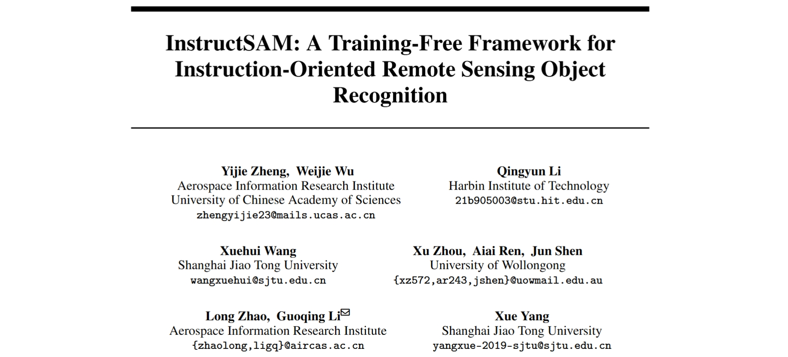
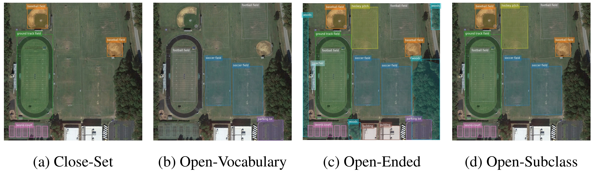

# 最新论文 | InstructSAM: 一种无需训练的指令导向遥感目标识别框架，代码开源

题目：InstructSAM: A Training-Free Framework for Instruction-Oriented Remote Sensing Object Recognition

论文：https://arxiv.org/abs/2505.15818

主页：https://VoyagerXvoyagerx.github.io/InstructSAM/

年份：2025

单位：空天院，哈工大，上海交通大学，卧龙岗大学

注：本篇由论文原作者审阅

## 核心贡献

基于自然语言指令的目标识别已成为计算机视觉领域的一种强大范式。然而，语义多样性训练数据的缺乏限制了视觉语言模型在遥感领域的零样本泛化能力。

本文提出了 InstructSAM，一种无需训练的框架，用于指令导向的目标计数、检测和分割（InstructCDS）任务；以及涵盖开放词汇（open-vocabulary）、开放式（open-ended）和开放子类别（open-subclass）设定的基准数据集 EarthInstruct。通过将目标检测重新建模为计数约束的掩码-标签匹配问题，InstructSAM 实现了无需置信度的目标识别，并且推理时间几乎不受目标数量的影响。

## InstructCDS 任务和 EarthInstruct 基准数据集

本文提出了一系列指令导向的目标识别任务，包括目标计数（**C**ounting）、检测（**D**etection），和分割（**S**egmentation）。在 EarthInstruct 基准中，我们引入了三种具有实用价值的指令设定：

- **开放词汇**：识别用户指定的类别（如"足球场"、"停车场"）。
- **开放目标**：识别所有可见目标。
- **开放子类别**：识别父类中的目标。

除了上述三种基本指令设定外，EarthInstruct 允许针对不同数据集设计专用提示，以指导 LVLM 根据特定标注规则识别目标，从而应对多样化的用户需求和现实世界的数据集偏差。

NWPU-VHR-10 和 DIOR 数据集的标注偏差示例.
  

## InstructSAM 框架

为了应对训练数据缺乏、指令复杂多样的挑战，InstructSAM 将指令导向的目标检测分解为三个更容易实现的步骤：

1. **指令导向的目标计数**：大型视觉语言模型（LVLM）解释用户指令并预测目标类别和数量。
2. **类别无关掩码生成**：SAM2 自动生成高质量的掩码提案，与指令处理并行。
3. **计数约束的掩码-标签匹配**：遥感 CLIP 模型计算预测类别与掩码提案之间的语义相似性。通过将目标检测和分割问题重新建模为掩码-标签匹配问题，融合语义相似性与全局计数约束，使用二元整数规划（BIP）求解器得到匹配结果。

推理中间步骤可视化
  

不同指令设定下的识别结果对比
  

## 关键结果与性能亮点
本文选取 Qwen2.5-VL-7B 和 GPT-4o 作为目标计数器，SAM2 作为候选掩码生成模型，GeoRSCLIP 进行相似度计算。

- **最先进的性能**：在 EarthInstruct 基准上，InstructSAM 在多个指令设置和任务种类上的零样本表现，超过了在遥感目标检测和分割数据上训练过的模型。
- **无需训练与置信度**：无需特定任务上的训练或微调，预测过程无需置信度阈值过滤。
- **高效推理**：推理时间几乎不受目标数量的影响，显著减少了输出词元数和总运行时间。
- **强大的泛化能力**：在配备通用 CLIP 模型时，能够有效识别自然图像中的目标。

### 开放词汇识别结果

### 开放目标识别结果

### 开放子类别识别结果

### 推理时间分析

<!--  -->

在开放式目标检测的设定下，InstructSAM 展现出和近乎常数（和预测的边界框数量无关）的推理时长，而其他方法的推理时间会随目标数量线性增长。与将边界框表示为自然语言词元（token）的方法不同，InstructSAM-Qwen 相比 Qwen2.5-VL 减少了 89% 的输出词元数和 32% 的总推理时间。随着模型规模的扩大，这一优势更加显著，凸显了 InstructSAM 框架的高效性。

### 泛化至自然图像

InstructSAM 的基础模块可以根据使用需求灵活替换。使用通用 CLIP 模型时，InstructSAM 也可以识别自然图像中的目标。

## 分析与讨论

### 提示词工程

<!--  -->

根据数据集的标注规则设计提示词，可以显著提高 GPT-4o 的开放词汇目标计数的性能，甚至和闭集的 Faster-RCNN 模型（使用先检测后计数的方法）相当。

### 无需置信度的方法

传统检测器的最终预测结果往往需要使用一个固定的置信度阈值来过滤调低质量的预测框。而面对训练集分布以外的输入，一个固定的置信度的阈值无法让所有图像和所有类别的性能都达到最优。InstructSAM 使用计数作为约束，无需使用置信度阈值进行过滤，对不同图像和不同类别目标的适应性更强。

### 局限性与未来方向

InstructSAM 的性能依赖于基础模型（LVLM、SAM、CLIP）的能力。未来随着这些遥感基础模型的进步，特别是在语义信息更丰富的遥感数据上训练，可以进一步提升InstructSAM的能力。

> 更多图表和技术细节请见原文